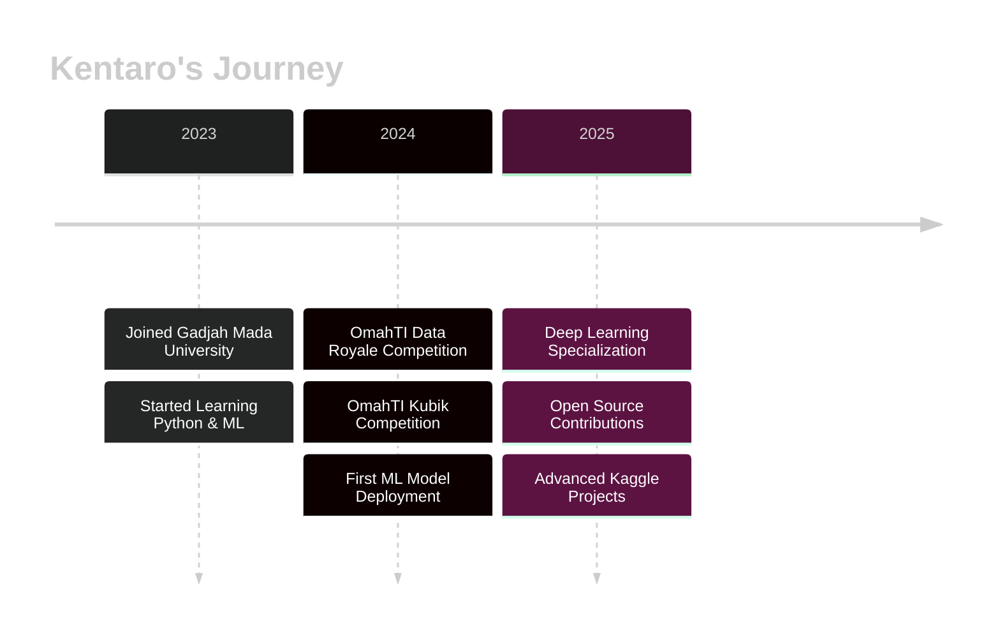

<div align="center">

<!-- Hero Header dengan Particle Effect -->


</div>

<!-- Typing SVG dengan Multiple Lines -->
<p align="center">
  <a href="https://git.io/typing-svg">
    
  </a>
</p>

<!-- Animated Badges -->
<p align="center">
  
  
  
  
</p>

<!-- Profile Badges dengan Animasi -->
<p align="center">
  
  
  
</p>

---

<details open>
<summary><h2>🚀 About Me</h2></summary>


```typescript
const kentaro = {
    pronouns: "He" | "Him",
    location: "Yogyakarta, Indonesia 🇮🇩",
    education: {
        university: "Gadjah Mada University",
        degree: "Computer Science",
        year: "2023-Present"
    },
    code: ["Python", "C++", "SQL", "R"],
    technologies: {
        datascience: {
            python: ["Pandas", "NumPy", "Scikit-learn"],
            visualization: ["Matplotlib", "Seaborn", "Plotly"],
            ml: ["TensorFlow", "PyTorch", "XGBoost"]
        },
        databases: ["PostgreSQL", "MySQL", "MongoDB"],
        tools: ["Jupyter", "Git", "Docker", "Linux"]
    },
    currentFocus: "Building ML models & Kaggle competitions 🏆",
    funFact: "I debug with print() and I'm not ashamed! 😄",
    goal2025: "Master Deep Learning & Contribute to Open Source 🎯"
};
```

<br clear="right"/>

### 🎯 Current Activities

```python
class CurrentlyDoing:
    def __init__(self):
        self.learning = ["Deep Learning", "MLOps", "Data Engineering"]
        self.working_on = ["Kaggle Competitions", "Personal ML Projects"]
        self.reading = ["Hands-On Machine Learning", "Deep Learning Book"]
        self.hobbies = ["Competitive Programming", "Chess", "Anime"]
    
    def daily_routine(self):
        activities = {
            "morning": "☕ Coffee + Leetcode",
            "afternoon": "📚 Study ML Algorithms", 
            "evening": "💻 Build Projects",
            "night": "📊 Kaggle Competitions"
        }
        return activities
```

### 💪 Skills & Expertise

<table>
<tr>
<td valign="top" width="33%">

#### 🎨 Frontend


</td>
<td valign="top" width="33%">

#### ⚙️ Backend


</td>
<td valign="top" width="33%">

#### 📊 Data Science


</td>
</tr>
</table>

</details>

---

<details open>
<summary><h2>🏆 Featured Projects</h2></summary>

<div align="center">

<!-- Project Cards dengan Stats -->
<table>
<tr>
<td width="50%">

<h3 align="center">🍄 Mushroom Classification</h3>

<div align="center">
  <a href="https://github.com/kentarotaro/data-royale-mushroom-classification">
    
  </a>
</div>

<p align="center">
  
  
  
</p>

**🎯 OmahTI Data Royale - Kaggle Competition**

ML model untuk klasifikasi jamur beracun vs. dapat dimakan dengan akurasi tinggi. Menggunakan feature engineering, data preprocessing, dan ensemble methods.

**Key Features:**
- ✅ Advanced Feature Engineering
- ✅ Cross-Validation Strategy
- ✅ Hyperparameter Tuning
- ✅ Model Ensemble (XGBoost + Random Forest)

<p align="center">
  <a href="https://github.com/kentarotaro/data-royale-mushroom-classification">
    
  </a>
</p>

</td>
<td width="50%">

<h3 align="center">🎲 Ludo Game CLI</h3>

<div align="center">
  <a href="https://github.com/kentarotaro/ludo-game-cli">
    
  </a>
</div>

<p align="center">
  
  
  
</p>

**🎮 OmahTI Kubik Competition**

Game Ludo multiplayer lokal yang dibangun dengan pure C++. Implementasi game logic, AI player, dan user interface yang interaktif di terminal.

**Key Features:**
- ✅ Clean OOP Architecture
- ✅ Smart AI Opponent
- ✅ Colorful CLI Interface
- ✅ Multiplayer Support (2-4 players)

<p align="center">
  <a href="https://github.com/kentarotaro/ludo-game-cli">
    
  </a>
</p>

</td>
</tr>
</table>

<br>

### 🎨 More Projects Coming Soon...


</div>

</details>

---

<details open>
<summary><h2>💻 Tech Arsenal</h2></summary>

<br>

<div align="center">

### 🌐 Programming Languages

<p>
  
</p>

### 🧠 Data Science & Machine Learning

<p>
  
  
  
  
  
  
  
  
</p>

### 🗄️ Databases

<p>
  
</p>

### 🛠️ Tools & Platforms

<p>
  
  
  
  
</p>

### ☁️ Cloud & DevOps

<p>
  
  
</p>

</div>

<br>

### 📊 Skill Proficiency

```python
skills = {
    "Python": "████████████████████ 95%",
    "Machine Learning": "██████████████████░░ 90%", 
    "Data Analysis": "███████████████████░ 92%",
    "C++": "█████████████████░░░ 85%",
    "SQL": "█████████████████░░░ 88%",
    "Deep Learning": "███████████████░░░░░ 75%",
    "MLOps": "█████████████░░░░░░░ 65%",
    "Cloud Computing": "████████████░░░░░░░░ 60%"
}
```

</details>

---

<details open>
<summary><h2>📊 GitHub Analytics</h2></summary>

<br>

<div align="center">

<!-- GitHub Stats Cards -->
 


</div>

<!-- Contribution Graph -->
<div align="center">
  
</div>

<!-- Trophy Display -->
<div align="center">
  
</div>

<!-- 3D Contribution -->
<div align="center">
  
</div>

</details>

---

<details open>
<summary><h2>🎯 Achievements & Milestones</h2></summary>

<br>

<div align="center">



</div>

<br>

<table align="center">
<tr>
<td align="center" width="25%">

<br><strong>Competitions</strong>
<br>Kaggle & Hackathons
</td>
<td align="center" width="25%">

<br><strong>Education</strong>
<br>CS @ UGM
</td>
<td align="center" width="25%">

<br><strong>Projects</strong>
<br>10+ ML Projects
</td>
<td align="center" width="25%">

<br><strong>Learning</strong>
<br>Always Growing
</td>
</tr>
</table>

### 🏅 Certifications & Courses

| Certificate | Issuer | Status |
|:---:|:---:|:---:|
| 🎓 **Machine Learning Specialization** | Stanford Online | 🔄 In Progress |
| 🎓 **Deep Learning Specialization** | DeepLearning.AI | 📅 Planned |
| 🏆 **OmahTI Data Royale** | UGM | ✅ Completed |
| 🏆 **OmahTI Kubik** | UGM | ✅ Completed |

</details>

---

<details open>
<summary><h2>📚 Latest Blog Posts & Articles</h2></summary>

<br>

<!-- Blog Post Cards -->
<div align="center">

[](https://medium.com/@kentarotaro)

</div>

### 📝 Recent Posts

- 🔥 [Understanding Random Forest: A Beginner's Guide](https://medium.com/@kentarotaro/random-forest)
- 🚀 [My Journey into Data Science](https://medium.com/@kentarotaro/ds-journey)
- 💡 [Top 5 Kaggle Tips for Beginners](https://medium.com/@kentarotaro/kaggle-tips)
- 📊 [Data Preprocessing Techniques That Actually Work](https://medium.com/@kentarotaro/preprocessing)

</details>

---

<details>
<summary><h2>🎮 Hobbies & Interests</h2></summary>

<br>

<div align="center">

<table>
<tr>
<td align="center" width="33%">

<br><strong>Competitive Programming</strong>
<br><sub>LeetCode | Codeforces</sub>
</td>
<td align="center" width="33%">

<br><strong>Chess</strong>
<br><sub>Chess.com Enthusiast</sub>
</td>
<td align="center" width="33%">

<br><strong>Reading</strong>
<br><sub>ML Papers & Manga</sub>
</td>
</tr>
</table>

</div>

</details>

---

<details open>
<summary><h2>🌐 Connect With Me</h2></summary>

<br>

<div align="center">

### 💬 Let's Connect and Build Something Amazing Together!

<p>
  <a href="mailto:your.email@gmail.com">
    
  </a>
  <a href="https://linkedin.com/in/your-linkedin">
    
  </a>
  <a href="https://github.com/kentarotaro">
    
  </a>
  <a href="https://kaggle.com/kentarotaro">
    
  </a>
</p>

<p>
  <a href="https://instagram.com/your-instagram">
    
  </a>
  <a href="https://twitter.com/your-twitter">
    
  </a>
  <a href="https://medium.com/@kentarotaro">
    
  </a>
  <a href="https://dev.to/kentarotaro">
    
  </a>
</p>

<br>

### 📊 Profile Statistics

<p>
  
  
  
</p>

### 💌 Open for Collaboration

```diff
+ 🔥 Looking for collaboration on ML/AI projects
+ 💼 Open to internship opportunities in Data Science
+ 📧 Always happy to discuss: ML, Mathematics, and Tech
+ 🌟 Let's build something impactful together!
```

</div>

</details>

---

<div align="center">

### 🎯 Current Goals for 2025

<table>
<tr>
<td align="center">

**✅ Master Deep Learning**
<br>Complete specialization & build 5 DL projects

</td>
<td align="center">

**🏆 Kaggle Expert**
<br>Achieve Expert tier on Kaggle

</td>
<td align="center">

**🌟 Open Source**
<br>Contribute to 10+ repositories

</td>
</tr>
</table>

</div>

---

<div align="center">

### 💭 Random Dev Quote


</div>

---

<div align="center">

### 🐍 Watch my contribution graph get eaten by the snake 🐍

<picture>
  <source media="(prefers-color-scheme: dark)" srcset="https://raw.githubusercontent.com/kentarotaro/kentarotaro/output/github-contribution-grid-snake-dark.svg">
  <source media="(prefers-color-scheme: light)" srcset="https://raw.githubusercontent.com/kentarotaro/kentarotaro/output/github-contribution-grid-snake.svg">
  
</picture>

</div>

---

<div align="center">


### 🔥 Show some ❤️ by starring some of the repositories!


</div>
