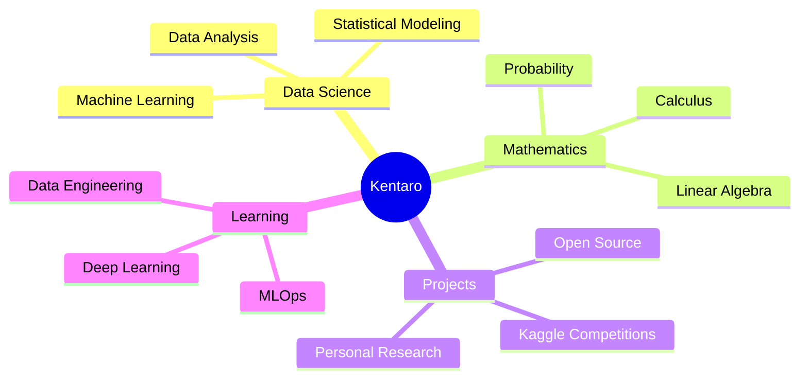

<div align="center">

<!-- Animated Header -->


</div>

<!-- Typing Animation -->
<p align="center">
  
</p>

<div align="center">
  
  [](https://github.com/kentarotaro)
  [](https://github.com/kentarotaro?tab=followers)
  [](https://github.com/kentarotaro)

</div>

---


### 👨‍💻 About Me

```yaml
name: Kentaro
located_in: Yogyakarta, Indonesia
current_status: CS Student
education: 
  - "Computer Science @ Gadjah Mada University"
fields_of_interests:
  - "Data Science & Analytics"
  - "Machine Learning & AI"
  - "Mathematics & Statistics"
currently_learning: 
  - "Deep Learning"
  - "Advanced ML Algorithms"
  - "Data Engineering"
2025_goals:
  - "Master Machine Learning"
  - "Contribute to Open Source"
  - "Build Impactful Projects"
hobbies: 
  - "Competitive Programming"
  - "Kaggle Competitions"
  - "Problem Solving"
```

<br>

---

### 🎯 What I'm Up To



---

### 🏆 Featured Projects

<div align="center">

<table>
<tr>
<td width="50%" align="center">
  
  
  
  **🍄 Mushroom Classification**
  
  ML model for OmahTI Data Royale Kaggle Competition to classify poisonous vs. edible mushrooms
  
  `Python` `Pandas` `Scikit-learn` `XGBoost`
  
  ⭐ High Accuracy | 📊 Data Analysis | 🤖 ML Pipeline
  
</td>
<td width="50%" align="center">
  
  
  
  **🎲 Ludo Game CLI**
  
  Local multiplayer Ludo game for OmahTI Kubik Competition built with pure C++
  
  `C++` `OOP` `Game Logic` `CLI`
  
  🎮 Multiplayer | ⚡ Fast | 🏗️ Well-Structured
  
</td>
</tr>
</table>

</div>

---

### 💻 Tech Stack & Tools

<div align="center">

#### 👨‍💻 Programming Languages

[](https://www.python.org/)
[](https://isocpp.org/)
[](https://www.postgresql.org/)
[](https://www.r-project.org/)

#### 📚 Data Science & ML

[](https://pandas.pydata.org/)
[](https://numpy.org/)
[](https://scikit-learn.org/)
[](https://www.tensorflow.org/)
[](https://pytorch.org/)

#### 📊 Data Visualization

[](https://matplotlib.org/)
[](https://seaborn.pydata.org/)
[](https://plotly.com/)

#### 🛠️ Tools & Technologies

[](https://jupyter.org/)
[](https://git-scm.com/)
[](https://code.visualstudio.com/)
[](https://colab.research.google.com/)
[](https://www.kaggle.com/)

</div>

---

### 📊 GitHub Statistics

<div align="center">
  
  
</div>

<div align="center">
  
  
</div>

<div align="center">
  
</div>

---

### 🏆 GitHub Trophies

<div align="center">
  
</div>

---

### 📈 Contribution Stats

<div align="center">
  
  

</div>

---

### 🎓 Certifications & Achievements

<div align="center">

| 🏅 Achievement | 📝 Description | 🗓️ Year |
|:---:|:---:|:---:|
| **OmahTI Data Royale** | Kaggle Competition Participant | 2024 |
| **OmahTI Kubik** | C++ Game Development Competition | 2024 |
| **UGM Computer Science** | Accepted as CS Student | 2023 |

</div>

---

### 📫 Connect With Me

<div align="center">

[](mailto:your.email@gmail.com)
[](https://linkedin.com/in/your-linkedin)
[](https://github.com/kentarotaro)
[](https://kaggle.com/kentarotaro)
[](https://instagram.com/your-instagram)
[](https://twitter.com/your-twitter)

</div>

---

### 💭 Random Dev Quote

<div align="center">


</div>

---

### 🐍 Contribution Snake

<div align="center">


</div>

---

<div align="center">

### 💖 Show some love by starring some repositories!


</div>
