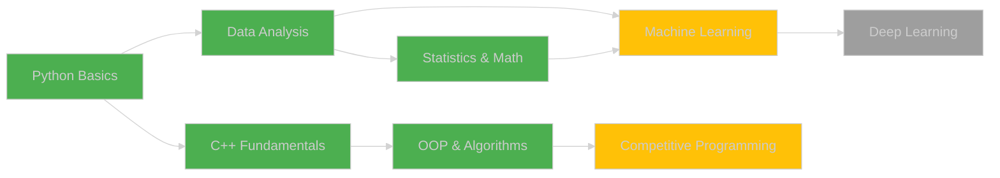

<div align="center">

<!-- Hero Header -->


</div>

<!-- Typing Animation -->
<p align="center">
  <a href="https://git.io/typing-svg">
    
  </a>
</p>

<!-- Status Badges -->
<p align="center">
  
  
  
</p>

<!-- Profile Stats -->
<p align="center">
  
  
  
</p>

---

<details open>
<summary><h2>👨‍💻 About Me</h2></summary>

<br>


### Hi there! 👋

I'm **Kentaro**, a Computer Science student at **Gadjah Mada University** with a passion for turning data into insights and solving problems with code.

```python
class AboutMe:
    def __init__(self):
        self.name = "Kentaro"
        self.location = "Yogyakarta, Indonesia 🇮🇩"
        self.university = "Gadjah Mada University"
        self.major = "Computer Science"
        self.year = "Currently studying"
        
    def interests(self):
        return {
            "primary": ["Data Science", "Mathematics"],
            "learning": ["Machine Learning", "Data Analysis"],
            "hobbies": ["Problem Solving", "Competitive Programming"]
        }
    
    def currently_working_on(self):
        return [
            "📚 Learning ML fundamentals",
            "🏆 Participating in competitions", 
            "💻 Building projects with Python & C++"
        ]
```

### 🎯 What I'm Currently Doing

- 📊 Learning **Data Science** and **Machine Learning** fundamentals
- 🧮 Deepening my understanding of **Mathematics** and **Statistics**
- 💡 Building projects to apply what I learn
- 🏆 Participating in competitions (Kaggle, OmahTI)
- 📖 Reading ML papers and documentation

<br clear="right"/>

</details>

---

<details open>
<summary><h2>🏆 Featured Projects</h2></summary>

<br>

<div align="center">

<table>
<tr>
<td width="50%">

<h3 align="center">🍄 Mushroom Classification</h3>

<div align="center">
  <a href="https://github.com/kentarotaro/data-royale-mushroom-classification">
    
  </a>
</div>

<br>

**🎯 OmahTI Data Royale - Kaggle Competition**

Machine Learning model to classify poisonous vs. edible mushrooms. This was my first hands-on experience with data preprocessing, feature engineering, and model training.

**What I Learned:**
- 📊 Data cleaning and preprocessing with Pandas
- 🔍 Exploratory Data Analysis (EDA)
- 🤖 Using Scikit-learn for classification
- 📈 Model evaluation and validation

**Tech Stack:**
<p align="center">
  
  
  
  
</p>

</td>
<td width="50%">

<h3 align="center">🎲 Ludo Game CLI</h3>

<div align="center">
  <a href="https://github.com/kentarotaro/ludo-game-cli">
    
  </a>
</div>

<br>

**🎮 OmahTI Kubik Competition**

A local multiplayer Ludo game built entirely in C++. This project helped me strengthen my understanding of Object-Oriented Programming and game logic implementation.

**What I Learned:**
- 🎯 OOP principles in C++
- 🎮 Game logic and state management
- 💻 Working with terminal/CLI interface
- 🐛 Debugging and problem-solving

**Tech Stack:**
<p align="center">
  
  
  
</p>

</td>
</tr>
</table>

</div>

</details>

---

<details open>
<summary><h2>💻 Technologies I Work With</h2></summary>

<br>

<div align="center">

### 🚀 Languages I Know

<p>
  
  
</p>

### 📚 Data Science & ML (Learning)

<p>
  
  
  
  
</p>

### 🛠️ Tools & Platforms

<p>
  
  
  
  
  
</p>

</div>

<br>

### 📊 My Learning Progress

```text
Python           ████████████████████  Advanced        ⭐⭐⭐⭐
C++              ████████████████░░░░  Intermediate    ⭐⭐⭐
Pandas           ███████████████░░░░░  Intermediate    ⭐⭐⭐
Data Analysis    ██████████████░░░░░░  Learning        ⭐⭐
Machine Learning ████████████░░░░░░░░  Learning        ⭐⭐
Mathematics      ███████████████████░  Strong          ⭐⭐⭐⭐
```

*Note: I'm still learning and improving every day! 📚*

</details>

---

<details open>
<summary><h2>📊 GitHub Statistics</h2></summary>

<br>

<div align="center">

<!-- Main Stats -->
 


<!-- Languages & Activity -->


</div>

<!-- Contribution Graph -->
<div align="center">
  
</div>

<!-- Trophies -->
<div align="center">
  
</div>

</details>

---

<details open>
<summary><h2>🎯 My Journey & Goals</h2></summary>

<br>

<div align="center">

### 📚 Learning Roadmap



**Legend:** 🟢 Completed | 🟡 In Progress | ⚪ Planned

</div>

### 🏆 Achievements So Far

| 🎯 Milestone | 📝 Description | ✅ Status |
|:---|:---|:---:|
| **Accepted to UGM** | Computer Science Program | ✅ 2025 |
| **First ML Project** | Mushroom Classification | ✅ 2025 |
| **OmahTI Data Royale** | Kaggle Competition | ✅ 2025 |
| **OmahTI Kubik** | C++ Game Development | ✅ 2025 |

### 🎯 Goals for 2025

<table align="center">
<tr>
<td align="center" width="33%">

**📚 Learn More**
<br>

<br>
Complete ML fundamentals
<br>
Study statistics & math

</td>
<td align="center" width="33%">

**🏆 Compete More**
<br>

<br>
Join more Kaggle competitions
<br>
Improve ranking

</td>
<td align="center" width="33%">

**💻 Build More**
<br>

<br>
Create 5+ ML projects
<br>
Contribute to open source

</td>
</tr>
</table>

</details>

---

<details>
<summary><h2>🎮 When I'm Not Coding</h2></summary>

<br>

<div align="center">

<table>
<tr>
<td align="center" width="33%">

<br><strong>Problem Solving</strong>
<br><sub>LeetCode & Algorithm Practice</sub>
</td>
<td align="center" width="33%">

<br><strong>Learning</strong>
<br><sub>Reading & Online Courses</sub>
</td>
<td align="center" width="33%">

<br><strong>Exploring</strong>
<br><sub>New Technologies & Tools</sub>
</td>
</tr>
</table>

</div>

</details>

---

<details open>
<summary><h2>🌐 Connect With Me</h2></summary>

<br>

<div align="center">

### 💬 Let's Connect!

I'm always open to discussing data science, mathematics, programming, or just having a chat!

<p>
  <a href="mailto:your.email@gmail.com">
    
  </a>
  <a href="https://linkedin.com/in/your-linkedin">
    
  </a>
  <a href="https://github.com/kentarotaro">
    
  </a>
  <a href="https://kaggle.com/kentarotaro">
    
  </a>
</p>

<br>

### 🤝 Open to Collaboration

I'm interested in collaborating on:
- 📊 Data Science projects
- 🤖 Machine Learning experiments
- 🧮 Mathematical problem-solving
- 💻 Open source contributions

Feel free to reach out if you want to work together! 🚀

</div>

</details>

---

<div align="center">

### 💭 Quote I Live By


</div>

---

<div align="center">

### 🐍 Contribution Activity


</div>

---

<div align="center">


### 🌟 Always Learning, Always Growing 🌱


</div>
