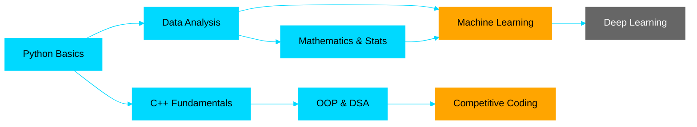

<div align="center">

<!-- Animated Header with Wave -->


</div>

<br>

<!-- Animated Typing Effect -->
<p align="center">
  
</p>

<br>

<!-- Profile Badges -->
<p align="center">
  
  
  
  
</p>

<p align="center">
  
  
  
</p>

<br>

---

<br>

## 👨‍💻 About Me


<br>

### Hey there! 👋

I'm **Kentaro**, a passionate **Computer Science student** at **Gadjah Mada University** 🎓

🔹 **Currently Learning:** Machine Learning, Data Analysis, and Statistics  
🔹 **Passionate About:** Data Science, Mathematics, and Problem Solving  
🔹 **Fun Fact:** I love turning complex data into simple insights! 📊  
🔹 **2025 Goal:** Master ML fundamentals and compete more on Kaggle 🏆

<br>

```python
class Kentaro:
    def __init__(self):
        self.name = "Kentaro"
        self.role = "CS Student & Aspiring Data Scientist"
        self.location = "Yogyakarta, Indonesia 🇮🇩"
        self.education = "Gadjah Mada University"
        self.languages = ["Python", "C++"]
        self.interests = ["Data Science", "Mathematics", "ML"]
        
    def say_hi(self):
        print("Thanks for dropping by! Let's connect and build something great together!")

me = Kentaro()
me.say_hi()
```

<br>

### 🎯 What I'm Currently Up To

- 📚 **Learning:** Machine Learning fundamentals with Scikit-learn
- 🏆 **Competing:** Active participant in Kaggle competitions
- 💻 **Building:** Data analysis projects with Python & Pandas
- 🧮 **Studying:** Advanced Mathematics & Statistics
- 📖 **Reading:** ML research papers and documentation

<br>

---

<br>

## 🏆 Featured Projects

<div align="center">

<table>
<tr>
<td width="50%" align="center">

### 🍄 Mushroom Classification

<a href="https://github.com/kentarotaro/data-royale-mushroom-classification">
  
</a>

<br>

**🎯 OmahTI Data Royale Competition**

My first ML project! Built a classification model to predict poisonous vs edible mushrooms using Pandas and Scikit-learn.

**📚 What I Learned:**
- Data preprocessing & cleaning
- Feature engineering techniques  
- Model training & evaluation
- Handling imbalanced datasets

<br>


</td>

<td width="50%" align="center">

### 🎲 Ludo Game CLI

<a href="https://github.com/kentarotaro/ludo-game-cli">
  
</a>

<br>

**🎮 OmahTI Kubik Competition**

A fully functional multiplayer Ludo game built with pure C++. Strengthened my OOP skills and game logic implementation.

**📚 What I Learned:**
- Object-Oriented Programming
- Game state management
- Terminal UI design
- Debugging complex logic

<br>


</td>
</tr>
</table>

</div>

<br>

---

<br>

## 💻 Tech Stack & Tools

<div align="center">

### 👨‍💻 Languages


<br><br>

### 📊 Data Science & Machine Learning


<br>

### 🛠️ Tools & Platforms


</div>

<br>

### 📊 My Skill Levels

<div align="center">

| Skill | Proficiency | Level |
|:---:|:---:|:---:|
| **Python** | ████████████████████ | Advanced ⭐⭐⭐⭐ |
| **C++** | ████████████████░░░░ | Intermediate ⭐⭐⭐ |
| **Pandas & NumPy** | ███████████████░░░░░ | Intermediate ⭐⭐⭐ |
| **Machine Learning** | ████████████░░░░░░░░ | Learning ⭐⭐ |
| **Data Analysis** | ██████████████░░░░░░ | Learning ⭐⭐ |
| **Mathematics** | ███████████████████░ | Strong ⭐⭐⭐⭐ |

</div>

<br>

<p align="center"><i>💡 Always learning and improving every day!</i></p>

<br>

---

<br>

## 📊 GitHub Statistics

<div align="center">


<br><br>


<br><br>


<br><br>


</div>

<br>

---

<br>

## 🎯 Learning Journey & Goals

<div align="center">

### 📈 My Learning Path



**🟦 Completed** | **🟧 In Progress** | **⬛ Planned**

</div>

<br>

### 🏆 Milestones Achieved

<div align="center">

| Achievement | Description | Year |
|:---:|:---|:---:|
| 🎓 **Admitted to UGM**   | Computer Science Program   | 2025 |
| 🏆 **Data Royale**       | OmahTI Kaggle Competition  | 2025 |
| 🎮 **Kubik Competition** | C++ Game Development       | 2025 |
| 🤖 **First ML Model**    | Mushroom Classification    | 2025 |

</div>

<br>

### 🎯 2025 Goals

<table align="center">
<tr>
<td align="center" width="33%">
<br>
<b>📚 Master ML Basics</b><br>
Complete fundamentals<br>
Build 5+ projects
</td>
<td align="center" width="33%">
<br>
<b>🏆 Kaggle Expert</b><br>
Join 10+ competitions<br>
Improve ranking
</td>
<td align="center" width="33%">
<br>
<b>💻 Contribute</b><br>
Open source projects<br>
Help community
</td>
</tr>
</table>

<br>

---

<br>

## 🌐 Connect With Me

<div align="center">

### 💬 Let's Connect and Collaborate!

<p>
<a href="mailto:your.email@gmail.com">
  
</a>
<a href="https://linkedin.com/in/your-linkedin">
  
</a>
<a href="https://github.com/kentarotaro">
  
</a>
<a href="https://kaggle.com/kentarotaro">
  
</a>
</p>

<br>

### 🤝 Open for Collaboration On:

**📊 Data Science Projects** | **🤖 Machine Learning** | **🧮 Math Problems** | **💻 Open Source**

<br>

💡 *Feel free to reach out for discussions, collaborations, or just to say hi!*

</div>

<br>

---

<br>

## 🐍 Contribution Snake

<div align="center">

<picture>
  <source media="(prefers-color-scheme: dark)" srcset="https://raw.githubusercontent.com/kentarotaro/kentarotaro/output/github-contribution-grid-snake-dark.svg">
  <source media="(prefers-color-scheme: light)" srcset="https://raw.githubusercontent.com/kentarotaro/kentarotaro/output/github-contribution-grid-snake.svg">
  
</picture>

<br>

<details>
<summary><b>🔧 How to Setup Snake Animation</b></summary>

<br>

**Step 1:** Create `.github/workflows/snake.yml` in your profile repository

**Step 2:** Add this code to `snake.yml`:

```yaml
name: Generate Snake

on:
  schedule:
    - cron: "0 */6 * * *" # every 6 hours
  workflow_dispatch:

jobs:
  build:
    runs-on: ubuntu-latest
    steps:
      - uses: actions/checkout@v3
      
      - uses: Platane/snk/svg-only@v3
        with:
          github_user_name: ${{ github.repository_owner }}
          outputs: |
            dist/github-contribution-grid-snake.svg
            dist/github-contribution-grid-snake-dark.svg?palette=github-dark
            
      - uses: crazy-max/ghaction-github-pages@v3.1.0
        with:
          target_branch: output
          build_dir: dist
        env:
          GITHUB_TOKEN: ${{ secrets.GITHUB_TOKEN }}
```

**Step 3:** Commit, push, and enable GitHub Actions in your repository settings!

**Step 4:** The snake will appear after the first workflow run ✨

</details>

</div>

<br>

---

<br>

<div align="center">

### 💭 Random Dev Quote


</div>

<br>

---

<br>

<div align="center">


<br>

### 🌟 Always Learning, Always Growing 🌱


</div>
