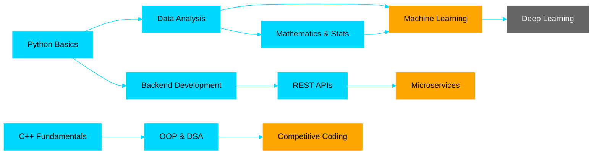

<div align="center">

<!-- Animated Header with Wave -->


</div>

<br>

<!-- Animated Typing Effect -->
<p align="center">
  
</p>

<br>

<!-- Profile Badges -->
<p align="center">
  
  
  
  
</p>

<p align="center">
  
  
  
</p>

<br>

---

<br>

## 👨‍💻 About Me


### Hey there! 👋

I'm **Aulia Kemal Syah**, a passionate **Computer Science student** at **Gadjah Mada University** 🎓

🔹 **Currently Learning:** Machine Learning, Data Analysis, and Statistics  
🔹 **Passionate About:** Data Science, Mathematics, and Problem Solving  
🔹 **Fun Fact:** I love turning complex data into simple insights! 📊  
🔹 **2025 Goal:** Master ML fundamentals and compete more on Kaggle 🏆

<br>

```python
class Kentaro:
    def __init__(self):
        self.name = "Aulia Kemal Syah"
        self.role = "CS Student & Aspiring Data Scientist"
        self.location = "Yogyakarta, Indonesia 🇮🇩"
        self.education = "Gadjah Mada University"
        self.languages = ["Python", "C++"]
        self.interests = ["Data Science", "Mathematics", "ML"]
        
    def say_hi(self):
        print("Thanks for dropping by! Let's connect and build something great together!")

me = Kentaro()
me.say_hi()
```

<br>


### 🎯 What I'm Currently Up To

- 📚 **Learning:** Machine Learning fundamentals & Backend Development with Node.js
- 🏆 **Competing:** Active participant in competitions
- 💻 **Building:** REST APIs and Data Science projects
- 🧮 **Studying:** Learn Mathematics & Statistics
- 📖 **Reading:** ML research papers and backend architecture best practices

<br>

---

<br>

## 🏆 Featured Projects

<div align="center">

<table>
<tr>
<td width="50%" align="center">

### 🏠 Airbnb Price Prediction

<a href="https://github.com/kentarotaro/airbnb-price-prediction">
  
</a>

<br>

**🎯 OmahTI Regression Competition**

Advanced ensemble model untuk prediksi harga Airbnb dengan MAPE optimization. Menggunakan stacking ensemble (LightGBM, XGBoost, CatBoost) dengan 190+ engineered features.

**📚 What I Learned:**
- Advanced feature engineering & NLP
- Stratified CV & ensemble methods
- MAPE optimization techniques
- Handling skewed distributions

<br>


</td>

<td width="50%" align="center">

### 🍽️ Smart Menu Catalog API

<a href="https://github.com/kentarotaro/gdgoc-menu-api">
  
</a>

<br>

**🚀 GDGOC Backend Project**

Production-ready REST API untuk manajemen menu restoran dengan integrasi Google Gemini AI. Fitur auto-description, calorie estimation, dan smart pricing.

**📚 What I Learned:**
- REST API design with Express.js
- PostgreSQL & Supabase integration
- AI integration (Google Gemini)
- Rate limiting & data sanitization

<br>


</td>
</tr>

<tr>
<td width="50%" align="center">

### 🍄 Mushroom Classification

<a href="https://github.com/kentarotaro/data-royale-mushroom-classification">
  
</a>

<br>

**🎯 OmahTI Data Royale Competition**

My first ML project! Built a classification model to predict poisonous vs edible mushrooms using Pandas and Scikit-learn.

**📚 What I Learned:**
- Data preprocessing & cleaning
- Feature engineering techniques  
- Model training & evaluation
- Handling imbalanced datasets

<br>


</td>

<td width="50%" align="center">

### 🎲 Ludo Game CLI

<a href="https://github.com/kentarotaro/ludo-game-cli">
  
</a>

<br>

**🎮 OmahTI Kubik Competition**

A fully functional multiplayer Ludo game built with pure C++. Strengthened my OOP skills and game logic implementation.

**📚 What I Learned:**
- Object-Oriented Programming
- Game state management
- Terminal UI design
- Debugging complex logic

<br>


</td>
</tr>
</table>

</div>

<br>

---

<br>

## 💻 Tech Stack & Tools

<div align="center">

### 👨‍💻 Languages


<br><br>

### 📊 Data Science & Machine Learning


<br>

### 🔧 Backend & Database


<br>

### 🛠️ Tools & Platforms


</div>

<br>

### 📊 My Skill Levels

<div align="center">

| Skill | Proficiency | Level |
|:---:|:---:|:---:|
| **Python** | ████████████████████ | Advanced ⭐⭐⭐⭐ |
| **C++** | ████████████████░░░░ | Intermediate ⭐⭐⭐ |
| **JavaScript/Node.js** | ███████████████░░░░░ | Intermediate ⭐⭐⭐ |
| **Pandas & NumPy** | ███████████████░░░░░ | Intermediate ⭐⭐⭐ |
| **Machine Learning** | ██████████████░░░░░░ | Learning ⭐⭐ |
| **Backend Development** | ███████████████░░░░░ | Intermediate ⭐⭐⭐ |
| **Data Analysis** | ██████████████░░░░░░ | Learning ⭐⭐ |
| **Mathematics** | ███████████████████░ | Strong ⭐⭐⭐⭐ |

</div>

<br>

<p align="center"><i>💡 Always learning and improving every day!</i></p>

<br>

---

<br>

## 📊 GitHub Statistics

<div align="center">


<br><br>


<br><br>


<br><br>


</div>

<br>

---

<br>

## 🎯 Learning Journey & Goals

<div align="center">

### 📈 My Learning Path


🟦 Completed | 🟧 In Progress | ⬛ Planned
</div>
<br>

🏆 Milestones Achieved
<div align="center">
- AchievementDescriptionYear🎓
- Admitted to UGMComputer Science Program2025🏠
- Airbnb PredictionOmahTI Regression Competition2025🍽️ 
- Smart Menu APIGDGOC Backend Development2025🍄
- Data RoyaleOmahTI Kaggle Competition2025🎮
- Kubik CompetitionC++ Game Development2025🤖 
- First ML ModelMushroom Classification2025
</div>
<br>

🎯 2025 Goals
<table align="center">
<tr>
<td align="center" width="33%">
<br>
  
<b>📚 Master ML & Backend</b><br>
Complete fundamentals<br>
Build 10+ projects
</td>
<td align="center" width="33%">
<br>
  
<b>🏆 Compete & Excel</b><br>
Join more competitions<br>
Improve technical skills
</td>
<td align="center" width="33%">
<br>
  
<b>💻 Contribute</b><br>
Open source projects<br>
Help community
</td>
</tr>
</table>
<br>

<br>

---

<br>

🌐 Connect With Me
<div align="center">
💬 Let's Connect and Collaborate!
<p>
<a href="mailto:kentarotarochan@gmail.com">
  
</a>
<a href="https://linkedin.com/in/aulia-kemal-syah-454942369/">
  
</a>
<a href="https://github.com/kentarotaro">
  
</a>
<a href="https://kaggle.com/kentarokujo">
  
</a>
</p>
<br>
🤝 Open for Collaboration On:
📊 Data Science Projects | 🤖 Machine Learning | 🔧 Backend APIs | 🧮 Math Problems | 💻 Open Source
<br>
💡 Feel free to reach out for discussions, collaborations, or just to say hi!
</div>
<br>

---

<br>
<div align="center">
🐍 My GitHub Contribution Snake
<picture>
  <source 
    media="(prefers-color-scheme: dark)"
    srcset="https://raw.githubusercontent.com/kentarotaro/kentarotaro/output/github-contribution-grid-snake-dark.svg" />
  <source 
    media="(prefers-color-scheme: light)"
    srcset="https://raw.githubusercontent.com/kentarotaro/kentarotaro/output/github-contribution-grid-snake.svg" />
  
<br>
</picture>

<br>

---

<br>
💭 Random Dev Quote
<br>
<br>

</div>

<div align="center">

<br>
<br>
🌟 Always Learning, Always Growing 🌱
<br>
<br>

